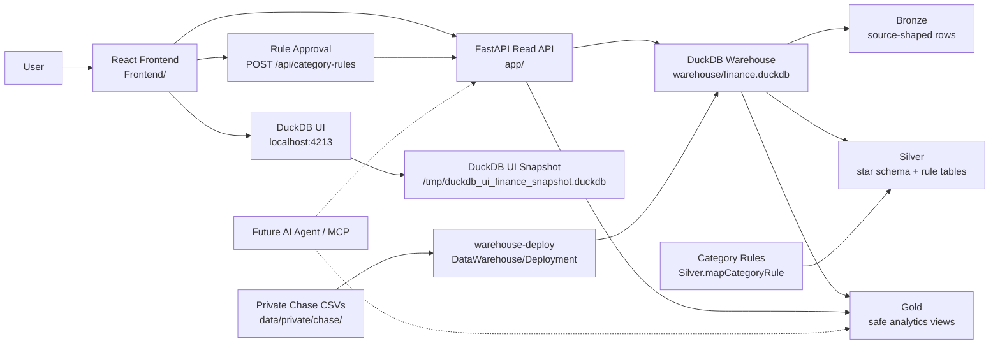

# AI Data Engineering Lab

Design-first project for learning data engineering architecture with personal Chase
financial data. The approved v0.1 design now has a Dockerized DuckDB warehouse, FastAPI
API, React dashboard, SQL-first ETL, and rule-driven transaction classification.

## Goal

Build a small, Dockerized, local-first data platform that ingests Chase checking and credit
card CSV exports, models them in DuckDB with medallion layers and a relational star schema,
serves safe analytics through FastAPI, shows those analytics in a React dashboard, and
later adds a text-to-SQL AI interface over Gold views only.

## Current Build Status

Current sequence:

1. Use cases - approved
2. Acceptance criteria - approved
3. Schema design - approved
4. Warehouse deployment - implemented
5. FastAPI read and rule-approval API - implemented
6. React dashboard - implemented and modularized
7. Data trust checks - implemented as DBA scripts
8. AI query interface / MCP - future design step

## Agreed Decisions

- Keep the architecture simple: no Databricks, Spark, cloud warehouse, or heavyweight lakehouse.
- Use open-source/local tools: Python, Docker, DuckDB, FastAPI, React.
- Use Chase CSV exports as the v1 data source.
- Put private CSV files under `data/private/chase/`.
- Keep generated DuckDB files under `warehouse/`.
- Use Bronze, Silver, and Gold schemas in DuckDB.
- Use camel case table and column names.
- Use descriptive table names.
- Use a Silver star schema.
- Gold views are the safe AI/query contract.
- The future AI feature starts as text-to-SQL over Gold views only.

## Architecture



Frontend responsibilities:

- render the dashboard shell
- call FastAPI endpoints
- keep raw/private data out of the browser
- later host the ask-your-data text box

Backend responsibilities:

- serve dashboard and rule-approval API endpoints
- keep dashboard reads on safe Gold views
- write approved category rules to Silver rule tables
- expose Gold views to future AI/MCP tools

Rule classification responsibilities:

- source parsing belongs in ETL SQL
- business classification belongs in `Silver.mapCategoryRule`
- system, manual, and future AI rules share the same rule table
- the fact load applies the highest-priority matching active rule

## Data Sources

Observed Chase CSV formats:

Checking export:

```text
Details, Posting Date, Description, Amount, Type, Balance, Check or Slip #
```

Credit card export:

```text
Transaction Date, Post Date, Description, Category, Type, Amount, Memo
```

Checking exports do not include categories. Credit card exports include Chase categories.

## Use Cases V0.1

1. Ingest Chase checking and credit card CSV files.
2. Preserve raw Chase data in Bronze for traceability.
3. Clean and normalize transactions into a Silver star schema.
4. Avoid double-counting spending across credit card purchases and checking payments.
5. Normalize Chase categories and rule-based checking categories into project categories.
6. Map raw transaction descriptions to normalized merchants using mapping rules.
7. Analyze monthly spending by category, parent category, merchant, and account type.
8. Identify uncategorized or poorly mapped transactions for future rule improvement.
9. Expose safe Gold analytics views for FastAPI and future AI text-to-SQL.
10. Keep sensitive raw fields out of Gold by default.

## Acceptance Criteria

To be drafted and approved next.

## Schema Design

Approved schema design:

- [Schema Design V0.1](docs/schema-design.md)

Core objects:

```text
Bronze.rawChaseCheckingTransaction
Bronze.rawChaseCreditTransaction

Silver.dimSourceFile
Silver.dimFinancialAccount
Silver.dimSpendingCategory
Silver.dimMerchant
Silver.dimCalendarDate
Silver.mapMerchantRule
Silver.mapCategoryRule
Silver.factTransaction

Gold.vw_MonthlySpendingByCategory
Gold.vw_MonthlyCashflow
Gold.vw_TopMerchantsBySpending
Gold.vw_UncategorizedTransactionSummary
Gold.vw_SpendingCategoryTrend
Gold.vw_TransactionLedger
```

## Privacy Rules

- Do not commit files under `data/private/`.
- Do not commit local DuckDB files under `warehouse/`.
- Keep checking `Balance` in Bronze only.
- Keep raw transaction descriptions in Bronze and Silver only.
- Do not expose raw descriptions, account last four, memo, balance, check/slip number, or
  source file names in Gold views.
- Anonymization is a v2 feature, not v1.

## Docker Direction

Docker Compose uses separate services:

```text
warehouse-deploy
api
web
duckdb-ui
```

The warehouse deployment service reads private CSV files, deploys DuckDB objects, runs
chunked SQL ETL, then exits. The API opens DuckDB read-only and serves FastAPI endpoints.

Build the local image:

```bash
cd Docker
docker compose build
```

Start everything:

```bash
cd Docker
docker compose up -d
```

This starts a one-shot warehouse deployment and population service first, then starts the
API, React frontend, and DuckDB UI. Put private Chase CSV exports under:

```text
data/private/chase/
```

That folder is ignored by Git.

Check the services:

```bash
cd Docker
docker compose ps
```

Check the service:

```bash
curl http://127.0.0.1:4000/health
```

Open the React frontend:

```text
http://localhost:5173
```

Open DuckDB UI:

```text
http://localhost:4213
```

The UI opens a separate catalog database and attaches `warehouse/finance.duckdb` as
read-only under the alias `finance`.

DuckDB UI uses its own lightweight Docker requirements file so it can run a UI-compatible
DuckDB version while the API and ETL keep the main DuckDB runtime.

## Frontend Direction

All React frontend files live under:

```text
Frontend/
  README.md
  package.json
  index.html
  src/
    App.jsx
    main.jsx
    styles.css
    api/
      warehouseApi.js
    components/
      DashboardCharts.jsx
      DashboardFilterBar.jsx
      TransactionTable.jsx
      ...
    controllers/
      dashboardController.js
    domain/
      transactionAnalytics.js
      transactionFilter.js
      categoryRuleSuggestionService.js
      csvExporter.js
      ...
    mockData/
      dashboardMockData.js
```

Run the frontend locally after installing Node dependencies:

```bash
cd Frontend
npm install
npm run dev
```

The dashboard is intentionally one page: top filters, summary cards, insight cards,
cashflow/category/merchant/account panels, suggested category rules, and a transaction
table.

The dashboard controller calls FastAPI first. If the API or DuckDB warehouse is unavailable,
it falls back to mock data from `Frontend/src/mockData/`.

`App.jsx` is kept as the orchestration shell. Presentational JSX lives in
`Frontend/src/components/`, while filter, analytics, rule suggestion, date, formatting, and
CSV-export behavior lives in `Frontend/src/domain/`.

Start only the React UI:

```bash
cd Docker
docker compose up -d web
```

The ETL is idempotent. Bronze transaction tables and `Silver.factTransaction` are loaded
with DuckDB `MERGE` statements, using source-file hashes and source row numbers as the
transaction grain.

See warehouse objects and row counts:

```bash
curl http://127.0.0.1:4000/api/warehouse/objects
curl http://127.0.0.1:4000/api/warehouse/row-counts
```

Docker-specific files live under:

```text
Docker/
  Dockerfile
  docker-compose.yml
  requirements.txt
  requirements-ui.txt
```

All source/config files that support comments include a top header with purpose and
dependencies. JSON files such as `package.json` and `package-lock.json` are excluded
because JSON comments are invalid.

## Data Warehouse Layout

SQL objects live under:

```text
DataWarehouse/
  Bronze/
    Tables/
    Views/
  Silver/
    Tables/
    Views/
    Seeds/
  Gold/
    Tables/
    Views/
  ETL/
    Bronze/
    Silver/
  Deployment/
  DBA/
```

Deploy the current schema locally with:

```bash
.venv/bin/python DataWarehouse/Deployment/deployWarehouse.py --reset
```
