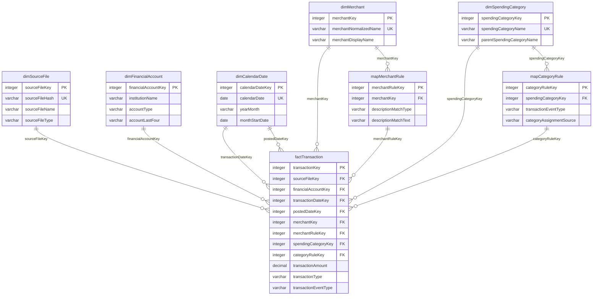

# Schema Design V0.1

Status: approved for v1 implementation.

This document defines the first version of the DuckDB schema. It follows a lightweight
medallion structure:

```text
Bronze = source-shaped Chase CSV rows
Silver = constrained relational star schema
Gold = safe analytics views for FastAPI and future text-to-SQL
```

## Naming Rules

- Schemas use Pascal case: `Bronze`, `Silver`, `Gold`.
- Tables and columns use camel case.
- Surrogate primary keys use the `Key` suffix.
- Natural keys are unique constraints over real business columns, not artificial
  `NaturalKey` columns.
- All Bronze and Silver tables include UTC audit columns:

```text
createdDatetime
modifiedDatetime
```

## Defaults And Unknown Members

Defaults should make the warehouse robust without hiding data quality problems.

Approved defaults:

```text
Bronze recordKey
  Starts at 100 and increments by 100.

Missing dimension foreign key
  Use -1 and point to an explicit Unknown row in the referenced dimension or map table.

Missing date
  Use calendarDateKey = 19000101, representing 1900-01-01.

createdDatetime / modifiedDatetime
  Store UTC ETL timestamps.

isActive
  Default true.

sourceSystemName
  Default chase for Chase source rows.

rulePriority
  Default 0. Higher number wins.

categoryAssignmentSource
  Default fallback when no stronger rule assigns the category.

transactionEventType
  Default other only for fallback/unknown classifications.
```

Guidance:

- Use `-1` only for missing/unknown keys, not for real business values.
- Keep source values in Bronze even when they are invalid or missing.
- Prefer explicit fallback rows over null foreign keys in Silver facts.
- Do not use defaults that silently convert bad financial amounts into valid-looking data.

## Bronze Tables

Bronze preserves Chase source data as text plus load metadata.

### Bronze.rawChaseCheckingTransaction

```text
recordKey integer primary key
sourceFileName varchar not null
sourceFileHash varchar not null
sourceRowNumber integer not null
createdDatetime timestamp not null
modifiedDatetime timestamp not null

details varchar
postingDate varchar
description varchar
amount varchar
type varchar
balance varchar
checkOrSlipNumber varchar
```

Constraints:

```text
recordKey starts at 100 and increments by 100
unique (sourceFileHash, sourceRowNumber)
sourceRowNumber > 0
```

### Bronze.rawChaseCreditTransaction

```text
recordKey integer primary key
sourceFileName varchar not null
sourceFileHash varchar not null
sourceRowNumber integer not null
createdDatetime timestamp not null
modifiedDatetime timestamp not null

transactionDate varchar
postDate varchar
description varchar
category varchar
type varchar
amount varchar
memo varchar
```

Constraints:

```text
recordKey starts at 100 and increments by 100
unique (sourceFileHash, sourceRowNumber)
sourceRowNumber > 0
```

## Silver Tables

Silver contains the relational model used by ETL, validation, and internal debugging.

## Silver ER Diagram

The Silver layer is a star schema. `Silver.factTransaction` is the central fact table.
Dimensions and mapping tables join to the fact through `Key` columns.

Date keys follow the usual warehouse pattern:

```text
Silver.factTransaction.transactionDateKey -> Silver.dimCalendarDate.calendarDateKey
Silver.factTransaction.postedDateKey      -> Silver.dimCalendarDate.calendarDateKey
```

The fact table stores the date keys directly. You only join to `Silver.dimCalendarDate`
when a query needs calendar attributes such as `yearMonth`, `calendarQuarter`,
`monthStartDate`, `calendarDayName`, or `isWeekend`.



## Join Pattern

Join the fact table to dimensions using matching `Key` columns.

For simple date filtering, use date keys directly:

```sql
select
    count(*) as transactionCount,
    sum(transactionAmount) as netAmount
from Silver.factTransaction
where transactionDateKey between 20250101 and 20250131;
```

Join to `Silver.dimCalendarDate` when you need calendar attributes for reporting.

Example:

```sql
select
    d.yearMonth,
    c.parentSpendingCategoryName,
    c.spendingCategoryName,
    sum(abs(t.transactionAmount)) as grossSpendingAmount
from Silver.factTransaction as t
join Silver.dimCalendarDate as d
    on t.transactionDateKey = d.calendarDateKey
join Silver.dimSpendingCategory as c
    on t.spendingCategoryKey = c.spendingCategoryKey
where t.transactionEventType = 'purchase'
group by
    d.yearMonth,
    c.parentSpendingCategoryName,
    c.spendingCategoryName
order by
    d.yearMonth,
    grossSpendingAmount desc;
```

Example with merchant and account dimensions:

```sql
select
    a.accountType,
    m.merchantDisplayName,
    c.spendingCategoryName,
    count(*) as purchaseCount,
    sum(abs(t.transactionAmount)) as totalPurchaseAmount
from Silver.factTransaction as t
join Silver.dimFinancialAccount as a
    on t.financialAccountKey = a.financialAccountKey
join Silver.dimMerchant as m
    on t.merchantKey = m.merchantKey
join Silver.dimSpendingCategory as c
    on t.spendingCategoryKey = c.spendingCategoryKey
where t.transactionEventType = 'purchase'
group by
    a.accountType,
    m.merchantDisplayName,
    c.spendingCategoryName
order by
    totalPurchaseAmount desc;
```

Lineage/debugging joins:

```sql
select
    t.transactionKey,
    f.sourceFileType,
    t.sourceRowNumber,
    r.ruleName as categoryRuleName,
    mr.ruleName as merchantRuleName
from Silver.factTransaction as t
join Silver.dimSourceFile as f
    on t.sourceFileKey = f.sourceFileKey
join Silver.mapCategoryRule as r
    on t.categoryRuleKey = r.categoryRuleKey
left join Silver.mapMerchantRule as mr
    on t.merchantRuleKey = mr.merchantRuleKey;
```

### Silver.dimSourceFile

```text
sourceFileKey integer primary key
sourceFileName varchar not null
sourceFileHash varchar not null
sourceFileType varchar not null
sourceSystemName varchar not null
rowCount integer not null
createdDatetime timestamp not null
modifiedDatetime timestamp not null
```

Constraints:

```text
unique (sourceFileHash)
sourceFileType in ('chaseCheckingCsv', 'chaseCreditCsv')
sourceSystemName = 'chase'
rowCount >= 0
```

### Silver.dimFinancialAccount

```text
financialAccountKey integer primary key
institutionName varchar not null
accountType varchar not null
accountLastFour varchar not null
accountDisplayName varchar not null
isActive boolean not null
createdDatetime timestamp not null
modifiedDatetime timestamp not null
```

Constraints:

```text
unique (institutionName, accountType, accountLastFour)
institutionName = 'chase'
accountType in ('checking', 'creditCard')
length(accountLastFour) = 4 or accountLastFour = 'unknown'
```

### Silver.dimSpendingCategory

```text
spendingCategoryKey integer primary key
spendingCategoryName varchar not null
parentSpendingCategoryName varchar not null
spendingCategoryDescription varchar
isActive boolean not null
createdDatetime timestamp not null
modifiedDatetime timestamp not null
```

Constraints:

```text
unique (spendingCategoryName)
```

### Silver.dimMerchant

```text
merchantKey integer primary key
merchantNormalizedName varchar not null
merchantDisplayName varchar not null
isActive boolean not null
createdDatetime timestamp not null
modifiedDatetime timestamp not null
```

Constraints:

```text
unique (merchantNormalizedName)
```

### Silver.dimCalendarDate

```text
calendarDateKey integer primary key
calendarDate date not null
calendarYear integer not null
calendarQuarter integer not null
calendarMonth integer not null
calendarMonthName varchar not null
calendarMonthNumber integer not null
calendarDayOfMonth integer not null
calendarDayOfWeek integer not null
calendarDayName varchar not null
isWeekend boolean not null
yearMonth varchar not null
monthStartDate date not null
monthEndDate date not null
createdDatetime timestamp not null
modifiedDatetime timestamp not null
```

Constraints:

```text
unique (calendarDate)
calendarDateKey = YYYYMMDD integer form of calendarDate
calendarMonth between 1 and 12
calendarMonthNumber between 1 and 12
calendarQuarter between 1 and 4
calendarDayOfMonth between 1 and 31
```

### Silver.mapMerchantRule

```text
merchantRuleKey integer primary key
ruleName varchar not null
descriptionMatchType varchar not null
descriptionMatchText varchar not null
merchantKey integer not null
rulePriority integer not null
isActive boolean not null
createdDatetime timestamp not null
modifiedDatetime timestamp not null
```

Constraints:

```text
unique (ruleName)
unique (descriptionMatchType, descriptionMatchText, merchantKey)
descriptionMatchType in ('exact', 'startsWith', 'contains')
foreign key (merchantKey) references Silver.dimMerchant(merchantKey)
```

Rule priority:

```text
higher number wins
```

### Silver.mapCategoryRule

```text
categoryRuleKey integer primary key
ruleName varchar not null
sourceAccountType varchar
sourceCategoryName varchar
transactionType varchar
descriptionMatchType varchar
descriptionMatchText varchar
spendingCategoryKey integer not null
transactionEventType varchar not null
categoryAssignmentSource varchar not null
rulePriority integer not null
isActive boolean not null
createdDatetime timestamp not null
modifiedDatetime timestamp not null
```

Constraints:

```text
unique (ruleName)
sourceAccountType is null or sourceAccountType in ('checking', 'creditCard')
descriptionMatchType is null or descriptionMatchType in ('exact', 'startsWith', 'contains')
transactionEventType in ('purchase', 'refund', 'payment', 'income', 'transfer', 'fee', 'debtPayment', 'other')
categoryAssignmentSource in ('chaseMapped', 'rule', 'fallback', 'manual', 'ai')
foreign key (spendingCategoryKey) references Silver.dimSpendingCategory(spendingCategoryKey)
```

Matching rules:

```text
descriptionMatchType and descriptionMatchText are both null, or both populated.
matching is case-insensitive after ETL normalization.
higher rulePriority wins.
fallback behavior is represented by low-priority seeded rules where practical.
```

### Silver.factTransaction

```text
transactionKey integer primary key
sourceFileKey integer not null
financialAccountKey integer not null
transactionDateKey integer not null
postedDateKey integer not null
merchantKey integer not null
merchantRuleKey integer
spendingCategoryKey integer not null
categoryRuleKey integer not null
sourceRowNumber integer not null
sourceRowIdentifier varchar not null
transactionNaturalKey varchar not null
transactionDescription varchar
transactionDescriptionClean varchar
sourceCategoryName varchar
transactionType varchar not null
transactionEventType varchar not null
transactionAmount decimal(18, 2) not null
createdDatetime timestamp not null
modifiedDatetime timestamp not null
```

Constraints:

```text
unique (sourceRowIdentifier)
unique (sourceFileKey, sourceRowNumber)
transactionEventType in ('purchase', 'refund', 'payment', 'income', 'transfer', 'fee', 'debtPayment', 'other')
foreign key (sourceFileKey) references Silver.dimSourceFile(sourceFileKey)
foreign key (financialAccountKey) references Silver.dimFinancialAccount(financialAccountKey)
foreign key (transactionDateKey) references Silver.dimCalendarDate(calendarDateKey)
foreign key (postedDateKey) references Silver.dimCalendarDate(calendarDateKey)
foreign key (merchantKey) references Silver.dimMerchant(merchantKey)
foreign key (merchantRuleKey) references Silver.mapMerchantRule(merchantRuleKey)
foreign key (spendingCategoryKey) references Silver.dimSpendingCategory(spendingCategoryKey)
foreign key (categoryRuleKey) references Silver.mapCategoryRule(categoryRuleKey)
```

Notes:

- `transactionAmount` preserves Chase's signed amount.
- `transactionType` preserves Chase's transaction type.
- `transactionEventType` stores the normalized event type.
- No `transactionDirection` column.
- No `amountAbsolute` column.
- `transactionNaturalKey` is stored for duplicate/reconciliation analysis but is not unique.

## Seed Data

Initial spending categories should include:

```text
Dining
Groceries
BillsAndUtilities
Transportation
Gas
Travel
Shopping
Entertainment
Health
Education
Home
Personal
ProfessionalServices
Income
OtherIncome
DebtPayment
Transfer
Fee
Refund
Uncategorized
```

Initial parent categories:

```text
Food
Household
Transportation
Lifestyle
Financial
Income
Adjustment
Uncategorized
```

Initial category rules should cover:

```text
creditCard + Sale + Chase category mappings -> purchase
creditCard + Return -> refund
creditCard + Payment -> payment
checking transfer types -> transfer
checking loan payment type -> debtPayment
checking fee type -> fee
checking obvious income types -> income
checking unknown -> other / Uncategorized fallback
```

Initial merchant rules may be minimal. Unmatched merchants should use deterministic cleanup
from `transactionDescriptionClean` and insert into `Silver.dimMerchant`.

## Gold Views

Gold views are the safe query contract for FastAPI and future AI text-to-SQL.

Gold must not expose:

```text
transactionDescription
transactionDescriptionClean
sourceFileName
accountLastFour
accountDisplayName
memo
balance
checkOrSlipNumber
```

Gold may expose:

```text
accountType
merchantDisplayName
spendingCategoryName
parentSpendingCategoryName
yearMonth
monthStartDate
transactionEventType
aggregated metrics
```

### Gold.vw_MonthlySpendingByCategory

Suggested columns:

```text
yearMonth
monthStartDate
accountType
parentSpendingCategoryName
spendingCategoryName
purchaseTransactionCount
refundTransactionCount
grossSpendingAmount
refundAmount
netSpendingAmount
```

### Gold.vw_MonthlyCashflow

Suggested columns:

```text
yearMonth
monthStartDate
accountType
transactionEventType
transactionCount
inflowAmount
outflowAmount
netCashflowAmount
```

### Gold.vw_TopMerchantsBySpending

Suggested columns:

```text
merchantDisplayName
accountType
parentSpendingCategoryName
spendingCategoryName
purchaseTransactionCount
totalSpendingAmount
averagePurchaseAmount
firstTransactionDate
lastTransactionDate
```

### Gold.vw_UncategorizedTransactionSummary

Suggested columns:

```text
yearMonth
monthStartDate
accountType
transactionType
transactionEventType
transactionCount
netTransactionAmount
```

### Gold.vw_SpendingCategoryTrend

Suggested columns:

```text
yearMonth
monthStartDate
parentSpendingCategoryName
spendingCategoryName
netSpendingAmount
previousMonthNetSpendingAmount
monthOverMonthChangeAmount
```

## Idempotency And Load Strategy

The ETL must be idempotent. Running the same ingestion command repeatedly with the same
source files must not duplicate transactions.

Supported ETL modes:

```text
ingest
  Load only new Chase CSV files into Bronze when sourceFileHash has not been seen before.

transform
  Rebuild or refresh Silver tables from Bronze and seed mapping tables.

full-refresh
  Drop and rebuild Bronze, Silver, and Gold from source files. This is explicit and mainly
  for development, schema changes, and tests.
```

Idempotency rules:

```text
Bronze source files are identified by sourceFileHash.
Bronze rows are unique by (sourceFileHash, sourceRowNumber).
Silver.dimSourceFile is unique by sourceFileHash.
Silver.factTransaction is unique by sourceRowIdentifier.
sourceRowIdentifier is derived from sourceFileHash + sourceRowNumber.
transactionNaturalKey is used for duplicate/reconciliation analysis but is not unique.
```

Bronze should be append-only for normal `ingest` runs. Silver can be rebuilt from Bronze
when transformation rules change.

## Indexing Strategy

No explicit `CREATE INDEX` statements are planned for v1.

Use constraints for data integrity:

```text
primary keys
foreign keys
unique constraints
check constraints
not null constraints
```

DuckDB automatically creates zonemaps for table columns and creates ART indexes for primary
keys, unique constraints, and foreign keys. Explicit indexes should only be added later if
`EXPLAIN ANALYZE` shows a real need.

## Implementation Notes

- ETL supports idempotent Bronze ingestion and explicit full refresh.
- Warehouse SQL objects are organized under `DataWarehouse/` by schema and object type.
- `DataWarehouse/Deployment/deployWarehouse.py` deploys SQL files in the order listed in
  `DataWarehouse/Deployment/deploymentOrder.txt`.
- Surrogate keys are deterministic integers assigned during ETL.
- `calendarDateKey` is deterministic `YYYYMMDD`.
- Bronze and Silver audit timestamps are UTC.
- Gold is implemented as views, not tables.
- Text-to-SQL should only receive Gold view names, columns, and descriptions.
